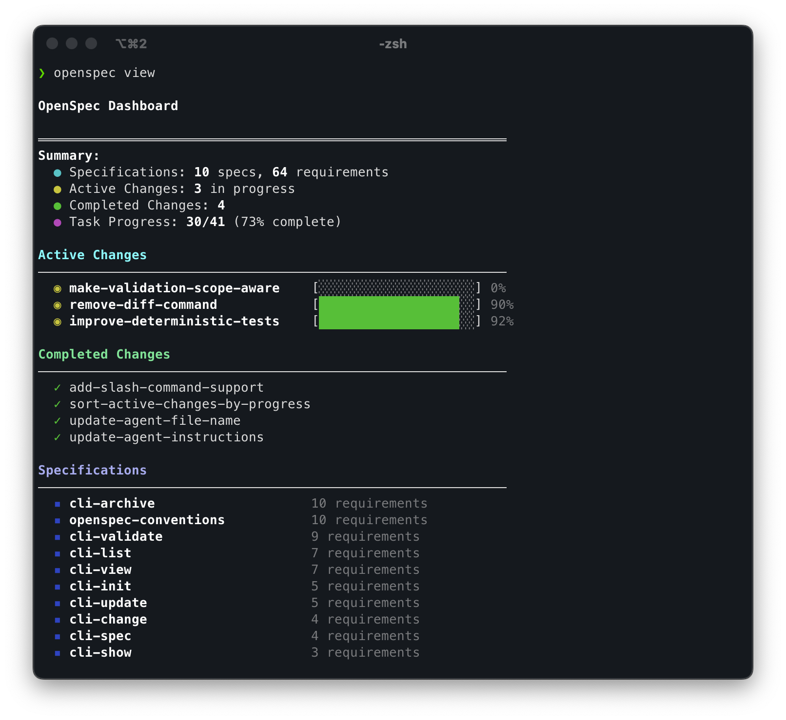

<p align="center">
  <a href="https://github.com/seanf-ai/OpenSpecPowers">
    <picture>
      <source srcset="assets/openspecpowers_bg.png">
      
    </picture>
  </a>
</p>

<p align="center">
  <a href="https://github.com/seanf-ai/OpenSpecPowers/actions/workflows/ci.yml"></a>
  <a href="https://www.npmjs.com/package/@seanf-ai/openspecpowers"></a>
  <a href="./LICENSE"></a>
</p>

<details>
<summary><strong>The most loved spec framework.</strong></summary>

[](https://github.com/seanf-ai/OpenSpecPowers/stargazers)
[](https://www.npmjs.com/package/@seanf-ai/openspecpowers)
[](https://github.com/seanf-ai/OpenSpecPowers/graphs/contributors)

</details>
<p></p>
Our philosophy:

```text
→ fluid not rigid
→ iterative not waterfall
→ easy not complex
→ built for brownfield not just greenfield
→ scalable from personal projects to enterprises
```

> [!TIP]
> **New workflow now available!** We've rebuilt OpenSpecPowers with a new artifact-guided workflow.
>
> Run `/opsp:propose "your idea"` to get started. → [Learn more here](docs/opsp.md)

<p align="center">
  Follow updates on <a href="https://github.com/seanf-ai/OpenSpecPowers">GitHub</a> · Use <a href="https://github.com/seanf-ai/OpenSpecPowers/issues">Issues</a> for bugs and requests.
</p>

<!-- TODO: Add GIF demo of /opsp:propose → /opsp:archive workflow -->

## See it in action

```text
You: /opsp:propose add-dark-mode
AI:  Created openspecpowers/changes/add-dark-mode/
     ✓ proposal.md — why we're doing this, what's changing
     ✓ specs/       — requirements and scenarios
     ✓ design.md    — technical approach
     ✓ tasks.md     — implementation checklist
     Ready for implementation!

You: /opsp:apply
AI:  Implementing tasks...
     ✓ 1.1 Add theme context provider
     ✓ 1.2 Create toggle component
     ✓ 2.1 Add CSS variables
     ✓ 2.2 Wire up localStorage
     All tasks complete!

You: /opsp:archive
AI:  Archived to openspecpowers/changes/archive/2025-01-23-add-dark-mode/
     Specs updated. Ready for the next feature.
```

<details>
<summary><strong>OpenSpecPowers Dashboard</strong></summary>

<p align="center">
  
</p>

</details>

## Quick Start

**Requires Node.js 20.19.0 or higher.**

Install OpenSpecPowers globally:

```bash
npm install -g @seanf-ai/openspecpowers@latest
```

One-command installer (after you host this repo):

```bash
curl -fsSL https://raw.githubusercontent.com/seanf-ai/OpenSpecPowers/main/scripts/install-openspowers.sh | bash -s -- --prefix "$HOME/.local"
```

One-command install + project bootstrap in current directory:

```bash
curl -fsSL https://raw.githubusercontent.com/seanf-ai/OpenSpecPowers/main/scripts/install-openspowers.sh | bash -s -- --prefix "$HOME/.local" --init "$PWD"
```

Or navigate to your project directory and initialize:

```bash
cd your-project
openspecpowers init
```

Now tell your AI: `/opsp:propose <what-you-want-to-build>`

If you want the expanded workflow (`/opsp:new`, `/opsp:continue`, `/opsp:ff`, `/opsp:verify`, `/opsp:sync`, `/opsp:bulk-archive`, `/opsp:onboard`), select it with `openspecpowers config profile` and apply with `openspecpowers update`.

> [!NOTE]
> Not sure if your tool is supported? [View the full list](docs/supported-tools.md) – we support 20+ tools and growing.
>
> Also works with pnpm, yarn, bun, and nix. [See installation options](docs/installation.md).

## Docs

→ **[Getting Started](docs/getting-started.md)**: first steps<br>
→ **[Workflows](docs/workflows.md)**: combos and patterns<br>
→ **[Commands](docs/commands.md)**: slash commands & skills<br>
→ **[CLI](docs/cli.md)**: terminal reference<br>
→ **[Supported Tools](docs/supported-tools.md)**: tool integrations & install paths<br>
→ **[Concepts](docs/concepts.md)**: how it all fits<br>
→ **[Multi-Language](docs/multi-language.md)**: multi-language support<br>
→ **[Customization](docs/customization.md)**: make it yours<br>
→ **[Power Gates](docs/power-gates.md)**: embedded quality enforcement
→ **[GitHub Publishing](docs/github-publishing.md)**: publish to your own account
→ **[SEO Guide](docs/seo.md)**: improve discoverability on GitHub and npm


## Why OpenSpecPowers?

AI coding assistants are powerful but unpredictable when requirements live only in chat history. OpenSpecPowers adds a lightweight spec layer so you agree on what to build before any code is written.

- **Agree before you build** — human and AI align on specs before code gets written
- **Stay organized** — each change gets its own folder with proposal, specs, design, and tasks
- **Work fluidly** — update any artifact anytime, no rigid phase gates
- **Use your tools** — works with 20+ AI assistants via slash commands
- **Enforce quality** — integrated power gates for test-first execution, root-cause debugging, and evidence-based completion

### How we compare

**vs. [Spec Kit](https://github.com/github/spec-kit)** (GitHub) — Thorough but heavyweight. Rigid phase gates, lots of Markdown, Python setup. OpenSpecPowers is lighter and lets you iterate freely.

**vs. [Kiro](https://kiro.dev)** (AWS) — Powerful but you're locked into their IDE and limited to Claude models. OpenSpecPowers works with the tools you already use.

**vs. nothing** — AI coding without specs means vague prompts and unpredictable results. OpenSpecPowers brings predictability without the ceremony.

## Updating OpenSpecPowers

**Upgrade the package**

```bash
npm install -g @seanf-ai/openspecpowers@latest
```

**Refresh agent instructions**

Run this inside each project to regenerate AI guidance and ensure the latest slash commands are active:

```bash
openspecpowers update
```

## Releasing

OpenSpecPowers now supports tag-driven npm publishing through GitHub Actions.

1. Bump the version locally:

```bash
npm version patch
```

2. Push the commit and tag:

```bash
git push origin main --follow-tags
```

3. GitHub Actions publishes `@seanf-ai/openspecpowers` automatically when the pushed tag matches `package.json`.

Repository requirement:

- Add repository secret `NPM_TOKEN`

## Usage Notes

**Model selection**: OpenSpecPowers works best with high-reasoning models. We recommend Opus 4.5 and GPT 5.2 for both planning and implementation.

**Context hygiene**: OpenSpecPowers benefits from a clean context window. Clear your context before starting implementation and maintain good context hygiene throughout your session.

## Contributing

**Small fixes** — Bug fixes, typo corrections, and minor improvements can be submitted directly as PRs.

**Larger changes** — For new features, significant refactors, or architectural changes, please submit an OpenSpecPowers change proposal first so we can align on intent and goals before implementation begins.

When writing proposals, keep the OpenSpecPowers philosophy in mind: we serve a wide variety of users across different coding agents, models, and use cases. Changes should work well for everyone.

**AI-generated code is welcome** — as long as it's been tested and verified. PRs containing AI-generated code should mention the coding agent and model used (e.g., "Generated with Claude Code using claude-opus-4-5-20251101").

### Development

- Install dependencies: `pnpm install`
- Build: `pnpm run build`
- Test: `pnpm test`
- Develop CLI locally: `pnpm run dev` or `pnpm run dev:cli`
- Conventional commits (one-line): `type(scope): subject`

### Project Policies

- Contribution guide: [CONTRIBUTING.md](CONTRIBUTING.md)
- Code of Conduct: [CODE_OF_CONDUCT.md](CODE_OF_CONDUCT.md)
- Security policy: [SECURITY.md](SECURITY.md)
- Support guide: [SUPPORT.md](SUPPORT.md)

## Other

<details>
<summary><strong>Telemetry</strong></summary>

OpenSpecPowers collects anonymous usage stats.

We collect only command names and version to understand usage patterns. No arguments, paths, content, or PII. Automatically disabled in CI.

**Opt-out:** `export OPENSPEC_TELEMETRY=0` or `export DO_NOT_TRACK=1`

</details>

<details>
<summary><strong>Maintainers & Advisors</strong></summary>

See [MAINTAINERS.md](MAINTAINERS.md) for the list of core maintainers and advisors who help guide the project.

</details>


## License

MIT
