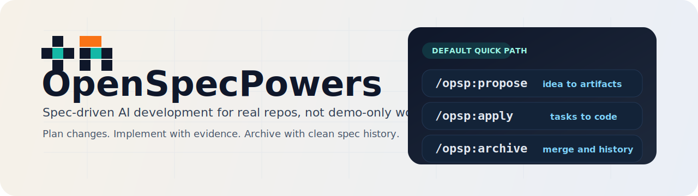
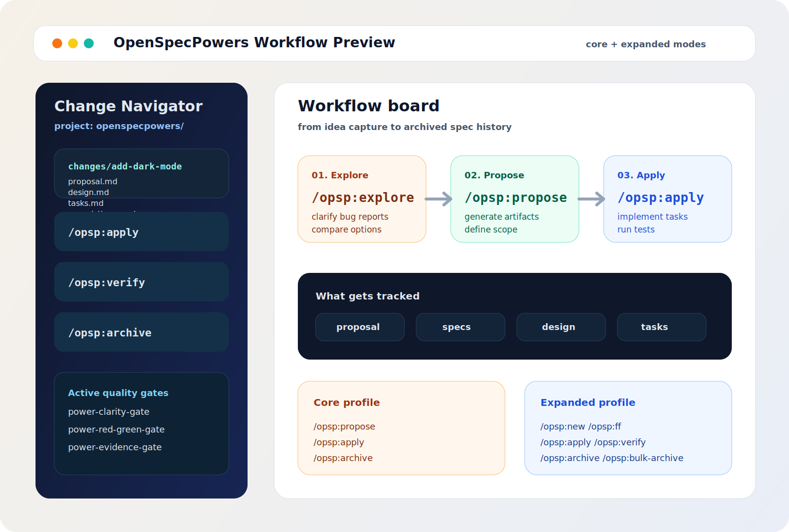

<p align="center">
  <a href="https://github.com/seanf-ai/OpenSpecPowers">
    
  </a>
</p>

<p align="center">
  <a href="https://github.com/seanf-ai/OpenSpecPowers/actions/workflows/ci.yml"></a>
  <a href="https://www.npmjs.com/package/@seanf-ai/openspecpowers"></a>
  <a href="./LICENSE"></a>
</p>

<p align="center"><strong>Spec-driven AI development that stays practical.</strong></p>

<p align="center">
  OpenSpecPowers gives AI coding agents a lightweight spec layer so they can plan changes,
  implement them, and verify the result without relying on fragile chat history alone.
</p>

<p align="center">
  Built for brownfield codebases, personal projects, and teams that want more predictability
  without adopting a heavyweight process.
</p>

<details>
<summary><strong>Project Snapshot</strong></summary>

[](https://github.com/seanf-ai/OpenSpecPowers/stargazers)
[](https://www.npmjs.com/package/@seanf-ai/openspecpowers)
[](https://github.com/seanf-ai/OpenSpecPowers/graphs/contributors)

</details>

> [!TIP]
> New here? Start with the `core` path:
> `/opsp:propose -> /opsp:apply -> /opsp:archive`
>
> Want the full artifact workflow? See [OPSP Workflow](docs/opsp.md).

## Why teams use it

- **Agree before you build** - generate proposal, specs, design, and tasks before code starts
- **Stay organized** - every change gets its own folder and archive trail
- **Work fluidly** - update artifacts as you learn, instead of getting stuck in rigid phases
- **Raise quality automatically** - built-in power gates enforce evidence, verification, and root-cause thinking
- **Use the tools you already have** - works with 20+ AI assistants and existing repos

## Start in 60 seconds

**Requires Node.js 20.19.0 or higher.**

1. Install OpenSpecPowers:

```bash
npm install -g @seanf-ai/openspecpowers@latest
```

2. Initialize it inside your project:

```bash
cd your-project
openspecpowers init
```

3. Tell your AI what to build:

```text
/opsp:propose add-dark-mode
/opsp:apply
/opsp:archive
```

That is the default quick path and the best starting point for most users.

<details>
<summary><strong>Alternative installation options</strong></summary>

One-command installer:

```bash
curl -fsSL https://raw.githubusercontent.com/seanf-ai/OpenSpecPowers/main/scripts/install-openspowers.sh | bash -s -- --prefix "$HOME/.local"
```

Install and bootstrap the current directory:

```bash
curl -fsSL https://raw.githubusercontent.com/seanf-ai/OpenSpecPowers/main/scripts/install-openspowers.sh | bash -s -- --prefix "$HOME/.local" --init "$PWD"
```

Also works with pnpm, yarn, bun, and nix. See [installation options](docs/installation.md).

</details>

## Choose your path

| If you want to...                       | Start here               | Typical flow                                                            |
| --------------------------------------- | ------------------------ | ----------------------------------------------------------------------- |
| Ship a straightforward feature or fix   | `core` profile           | `/opsp:propose -> /opsp:apply -> /opsp:archive`                         |
| Investigate first, then implement       | `core` + `/opsp:explore` | `/opsp:explore -> /opsp:propose -> /opsp:apply`                         |
| Control every artifact explicitly       | expanded workflow        | `/opsp:new -> /opsp:ff -> /opsp:apply -> /opsp:verify -> /opsp:archive` |
| Work on parallel or higher-risk changes | expanded workflow        | `/opsp:new` or `/opsp:propose`, then use explicit change names          |

To enable the expanded workflow (`/opsp:new`, `/opsp:continue`, `/opsp:ff`, `/opsp:verify`, `/opsp:sync`, `/opsp:bulk-archive`, `/opsp:onboard`):

```bash
openspecpowers config profile
openspecpowers update
```

## How the loop works


## See it in action

```text
You: /opsp:propose add-dark-mode
AI:  Created openspecpowers/changes/add-dark-mode/
     ✓ proposal.md - why we're doing this, what's changing
     ✓ specs/      - requirements and scenarios
     ✓ design.md   - technical approach
     ✓ tasks.md    - implementation checklist
     Ready for implementation!

You: /opsp:apply
AI:  Implementing tasks...
     ✓ 1.1 Add theme context provider
     ✓ 1.2 Create toggle component
     ✓ 2.1 Add CSS variables
     ✓ 2.2 Wire up localStorage
     All tasks complete!

You: /opsp:archive
AI:  Archived to openspecpowers/changes/archive/2025-01-23-add-dark-mode/
     Specs updated. Ready for the next feature.
```

<details>
<summary><strong>OpenSpecPowers Workflow Preview</strong></summary>

<p align="center">
  
</p>

</details>

## Read next

- **[Getting Started](docs/getting-started.md)** - first-time setup and your first change
- **[Workflows](docs/workflows.md)** - common patterns for features, bugs, and parallel work
- **[Commands](docs/commands.md)** - slash command reference
- **[CLI](docs/cli.md)** - terminal reference
- **[Supported Tools](docs/supported-tools.md)** - integrations and install paths
- **[Concepts](docs/concepts.md)** - how specs, changes, and archives fit together
- **[Customization](docs/customization.md)** - project config and schema customization
- **[Power Gates](docs/power-gates.md)** - built-in quality enforcement
- **[GitHub Publishing](docs/github-publishing.md)** - publish under your own account
- **[SEO Guide](docs/seo.md)** - improve discoverability on GitHub and npm

## How OpenSpecPowers compares

**vs. [Spec Kit](https://github.com/github/spec-kit)** (GitHub) — Thorough but heavyweight. Rigid phase gates, lots of Markdown, Python setup. OpenSpecPowers is lighter and lets you iterate freely.

**vs. [Kiro](https://kiro.dev)** (AWS) — Powerful but you're locked into their IDE and limited to Claude models. OpenSpecPowers works with the tools you already use.

**vs. nothing** — AI coding without specs means vague prompts and unpredictable results. OpenSpecPowers brings predictability without the ceremony.

## Updating OpenSpecPowers

**Upgrade the package**

```bash
npm install -g @seanf-ai/openspecpowers@latest
```

**Refresh agent instructions**

Run this inside each project to regenerate AI guidance and ensure the latest slash commands are active:

```bash
openspecpowers update
```

## Releasing

OpenSpecPowers now supports tag-driven npm publishing through GitHub Actions.

1. Bump the version locally:

```bash
npm version patch
```

2. Push the commit and tag:

```bash
git push origin main --follow-tags
```

3. GitHub Actions publishes `@seanf-ai/openspecpowers` automatically when the pushed tag matches `package.json`.

Repository requirement:

- Add repository secret `NPM_TOKEN`

## Usage Notes

**Model selection**: OpenSpecPowers works best with high-reasoning models. We recommend Opus 4.5 and GPT 5.2 for both planning and implementation.

**Context hygiene**: OpenSpecPowers benefits from a clean context window. Clear your context before starting implementation and maintain good context hygiene throughout your session.

## Contributing

**Small fixes** — Bug fixes, typo corrections, and minor improvements can be submitted directly as PRs.

**Larger changes** — For new features, significant refactors, or architectural changes, please submit an OpenSpecPowers change proposal first so we can align on intent and goals before implementation begins.

When writing proposals, keep the OpenSpecPowers philosophy in mind: we serve a wide variety of users across different coding agents, models, and use cases. Changes should work well for everyone.

**AI-generated code is welcome** — as long as it's been tested and verified. PRs containing AI-generated code should mention the coding agent and model used (e.g., "Generated with Claude Code using claude-opus-4-5-20251101").

### Development

- Install dependencies: `pnpm install`
- Build: `pnpm run build`
- Test: `pnpm test`
- Develop CLI locally: `pnpm run dev` or `pnpm run dev:cli`
- Conventional commits (one-line): `type(scope): subject`

### Project Policies

- Contribution guide: [CONTRIBUTING.md](CONTRIBUTING.md)
- Code of Conduct: [CODE_OF_CONDUCT.md](CODE_OF_CONDUCT.md)
- Security policy: [SECURITY.md](SECURITY.md)
- Support guide: [SUPPORT.md](SUPPORT.md)

## Other

<details>
<summary><strong>Telemetry</strong></summary>

OpenSpecPowers collects anonymous usage stats.

We collect only command names and version to understand usage patterns. No arguments, paths, content, or PII. Automatically disabled in CI.

**Opt-out:** `export OPENSPEC_TELEMETRY=0` or `export DO_NOT_TRACK=1`

</details>

<details>
<summary><strong>Maintainers & Advisors</strong></summary>

See [MAINTAINERS.md](MAINTAINERS.md) for the list of core maintainers and advisors who help guide the project.

</details>

## License

MIT
